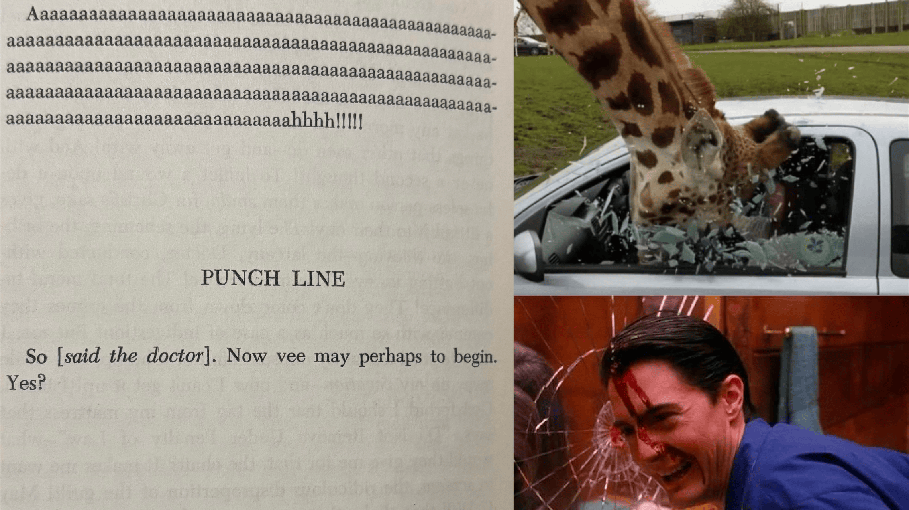

## From the Dog’s Desk

Spent this month listening to a lot of psych and punk. It seems like a natural move. We’re nearing a recession, powders are pricy, but weed and mushrooms are basically free. Dirtbags are back, throwing back a couple of beers on a weeknight is back, groceries are getting more expensive but cigarettes are staying the same price. We’re seeing videos of people who have posted anti-establishment sentiments online being detained. We’re seeing ourselves on camera all the time— last week I watched myself walk through the aisles at Home Depot, stand in line at the pharmacy, shoplift from Whole Foods, and walk into a few CVS locations. Thousands of government employees have had their positions eliminated. Bombs are still being dropped on Gaza. The death penalty is still legal. I’m not trying to get political* I’m just saying it’s a good time for gritty, angry, cathartic, rule breaking, weirdo music, and I think a lot of us are feeling it.

Music for making money is bogus, it is time for music for making a fuss. Keep your money in your mattress. In your closet, in your linens, in your refrigerator, at the laundromat, in the record store, in your fillings, in the pints you drink, up in smoke. Invest your money in cash, grass, and ass. Alter your clothes and make your own curtains, know your grocer’s names and what time they take out the unsellable produce, use a sharp knife to punch a new hole in your belt, loiter, shoot the shit. If everyone else has one, borrow theirs. Some years wax and others wane. Being broke doesn’t make you a loser, unless you think the game you’re playing can be won with money, man.

Some things don’t work out exactly as planned, but it doesn’t mean they didn’t work out, and it doesn’t make them less worth doing. It’s Red Rover: If you run as fast as you can into two people’s clenched fists, it’s likely to feel like getting punched in the gut, but you won’t break through without a little force. No one is owed your propriety, likewise no one owes you their approval. Make messes and make amends. Being broken doesn’t make you a loser, unless you think the game you’re playing is won by not getting hurt, man.

Participating in a system to the point of success within it, by design does not leave enough time, energy, or impetus to tear the system down. If you’re only playing games you can’t win, maybe you’re having a crisis of imagination, man.

Kick back, goof off, fool around, and enjoy some of the tunes I’ve been turning lately. It’s a little rock, a little punk, a little country, some stuff off the cuff and some on the pulse. It’s got two spoken word tracks this time, because that’s allowed. I’ve been enjoying shows on NTS like Loose Bones, Brown Acid Trippin, Hot Mess, and Carolina Soul. I’ve been enjoying catching rock shows around town. Remember guitars? Guitars rock. Looking for a punk to ask, if you know any.

-R

## Notes, just for fun

- This playlist screams out from the top with Fun Guy, a timeless sounding rock track that Arrhythmia also opened their April show with.
- If you’ve asked me how I’ve been the past year, you’ve likely gotten an answer like “I’m trying not to moralize my life, it simply is.” This playlist plays a lot with the idea of being “bad” or “dangerous” or “ugly” while also having a bit of a laugh about it. Anyhow the second track is Bad News, specifically because there’s a bit where Johnny makes a growling sound between laughs, something I do into the mirror before walking out of a public restroom, an act I saw my friend Stella engage in recently as well. I suggest it.
- Texas by Big Black fucking rips, and as a Texan I encourage you to call me “Tex” if the spirit ever moves you.
- My friend Ryan digs The Fall, I saw Vladimir Ivkovic at Nowadays and he played a great track by The Fall, So-Called Dangerous is my The Fall track for the month.
- Badtimes by Laika is funny as fuck.
- Every time I log into work I say “This is a job for a stupid man” and The Jesus Lizard kicks ass.
- Though it’s more than halfway through the set, I’d describe Staring at the Sun is being here to “set the tone.” I was on a train where police held commuters up to kick someone off for taking a nap, everyone was pissed. Uncentered ass cops are shutting down parties just to prove they can shut them down. So, Parties in the USA sets the tone too because it’s about community and a poor use of government funds while mostly actually being a silly song about partying.
- What’s the Ugliest Part of Your Body? Perv.
- The Jane’s Addiction track, Of Course, is seven minutes long, giving you plenty of time to consider a sensation not unlike slapping yourself in the face. It’s the psych rock center piece standing in for the probably 30 hours of psych I’ve listened to this month, so let it be seven minutes.
- Third Uncle makes more thematic sense once you listen to the following track, Terminal Twilight, which reminds me of the Angel Investor track I put on the last mix… urban paranoia? urban curiosity? The role we play as witness while living in density? I’ll tell you about my neighbors next time I see ya.
- Stella shared this bassvictim track with me, and it feels like growling into a mirror. I suggest it.
- I Got Cash is our second spoken word track and it’s even funnier and more cutting than the first.
- We wrap with an absolutely bonkers move, Loserstreet. I spent a lot of this month thinking about NEO, the old club in Chicago where I learned to dance, drink, sweat, smoke, and hang out with goths.

*I wouldn’t describe this playlist as being political, but music is not apolitical, life is not apolitical.

[my playlist](https://www.mixcloud.com/recumbentdog/head-through-the-window/)

additional listening in order of mention  
[Stella](https://on.soundcloud.com/Y7vcpTtAfuGbwKXb8)  
[Ryan](https://on.soundcloud.com/t8q3m8eo4dw219Un9)  
[Vladimir](https://on.soundcloud.com/mKzkB8T35r5RrCgLA)

[https://www.nts.live/shows/loose-bones](https://www.nts.live/shows/loose-bones)  
[https://www.nts.live/shows/brown-acid-journey](https://www.nts.live/shows/brown-acid-journey)  
[https://www.nts.live/shows/hotmess](https://www.nts.live/shows/hotmess)  
[https://www.nts.live/shows/carolinasoul](https://www.nts.live/shows/carolinasoul)  
[https://www.nts.live/shows/ARRHYTHMIA/episodes/arrhythmia-1st-april-2025](https://www.nts.live/shows/ARRHYTHMIA/episodes/arrhythmia-1st-april-2025)